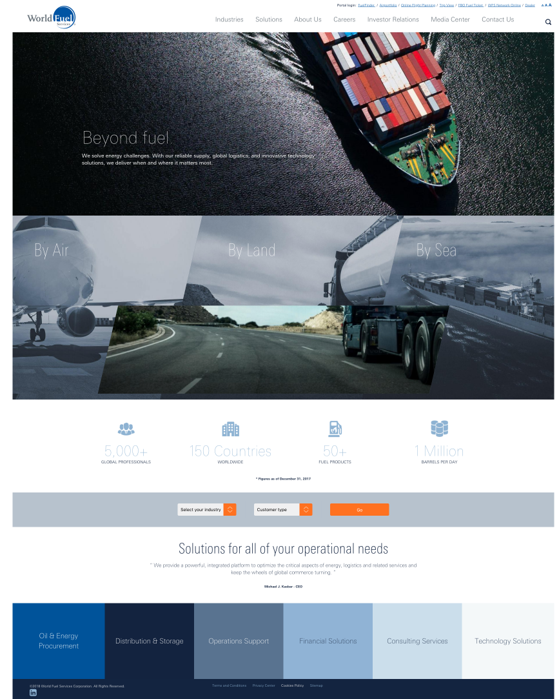

# Homepage

The Content-Type Standard Content Page is meant to provide the structure for the landing pages that in its majority will hold the paragraphs.

### Global Component

* [Header](./header)
* [Footer](./footer)
* [Floating Menu](./floating-menu)
* [GDPR Banner](./gdpr-banner)

### Paragraphs (PG):

- [Hero](./Hero)
- [Auto Scroller](./Auto-Scroller)
- [Info-Graphic](./Info-Graphic)
- [Text Content](./Text-Content)

### Design

