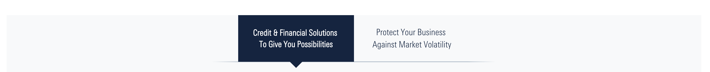

# Tabs

Tab allow to embbed other paragraphs inside, giving the editor the ability to set different layouts to the content using the same paragraphs that usually can be added independently

## Structure of the parent

| Field Name  |        Type         | Required | Details                                            |
| :---------- | :-----------------: | :------: | :------------------------------------------------- |
| Title       |     Plain Text      |    No    | Rendered as H3                                     |
| Description |      Long Text      |    No    | With WYSIWYG and characters counting, limit to 200 |
| tabs Item   | Paragraph reference |   Yes    | At least 2 maximum 6                               |

## Structure of the tab Item

| Field Name  |        Type         | Required | Details |
| :---------- | :-----------------: | :------: | :------ |
| Tab title   |     Plain Text      |    No    |         |
| Tab content | Paragraph reference |    No    |         |

##

