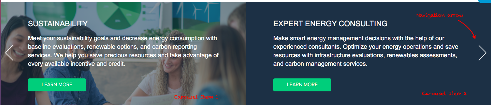
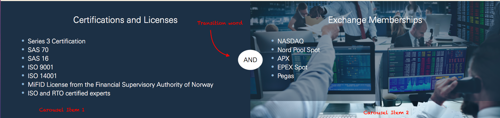

# Carousel

The **Carousel** paragraph allows Editors to add several blocks of content within a slice, that have the ability to rotate, displaying groups of 2 items together.

## Structure of the parent

| Field Name     |        Type         | Required | Details                                            |
| :------------- | :-----------------: | :------: | :------------------------------------------------- |
| Title          |     Plain Text      |    No    | Rendered as H3                                     |
| Description    |      Long Text      |    No    | With WYSIWYG and characters counting, limit to 200 |
| Style          |     Text(list)      |   Yes    | Default Value "slider", values: Slider, Static     |
| Separator Word |     Plain Text      |    No    | Only visible if Style = Static                     |
| Carousel Item  | Paragraph reference |   Yes    | 2 if Style = Static, unlimited if Slider           |

## Structure of the InfoGraphic Item

| Field Name       |    Type    | Required | Details             |
| :--------------- | :--------: | :------: | :------------------ |
| Image            |   Image    |    No    | jpg, jpeg, png, gif |
| Background Color |   Color    |    No    |                     |
| Title            | Plain Text |    No    |                     |
| Item Description | long Text  |    No    |                     |
| Link             |    link    |    No    |                     |

## 

